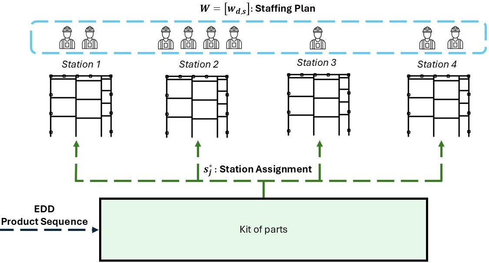

# Multi-objective workforce optimisation for off-site assembly

This repository implements the parallel Pareto Simulated Annealing framework titled [**“Multi-objective Workforce Allocation for Off-site Construction Assembly Using Parallel Simulated Annealing”**](pdfs/TCOT_Final_AS.pdf), for the Conference Transforming Construction with Off-site Methods and Technologies (TCOT 2026).

The method creates a day-by-day staffing plan for parallel assembly stations. It balances delivery reliability against labour expenditure while accounting for diminishing productivity gains when several workers share one station.

## Optimisation problem



*Assembly job-shop formulation from Figure 1 of the accompanying TCOT 2026 paper.*

Products enter the system in a fixed **Earliest Due Date (EDD)** sequence. For every product, the scheduler selects the station that gives the earliest feasible completion time under the current staffing plan and station availability.

The core decision variable is the staffing matrix

$$
W = [w_{d,s}] \in \mathbb{Z}^{D \times S},
$$

where $w_{d,s}$ is the number of workers assigned to station $s$ on day $d$. A value of zero closes that station for the day. Each station is limited to `max_workers_per_station`, and its effective processing rate is

$$
v_{d,s} = w_{d,s}^{\alpha}, \qquad 0 < \alpha \leq 1,
$$

so the efficiency exponent $\alpha$ captures coordination and workspace losses when multiple workers collaborate.

The optimiser minimizes three objectives:

1. **Labour cost** - staffed worker-hours up to the last production day, multiplied by the hourly labour rate.
2. **Total tardiness** - the sum of `max(0, completion time - deadline)` across all jobs.
3. **Delay severity** - the mean tardiness among delayed jobs only.

Weekends are treated as non-working days. Jobs may continue across multiple working days, but jobs assigned to the same station cannot overlap.

## Context-aware neighbourhood moves

The modular neighbourhood implementation is in [`adv_neigh.py`](adv_neigh.py). `build_move_context()` reconstructs four signals from the current solution:

- **Tardiness pressure** identifies days contributing to late completion and propagates part of that pressure to preceding working days.
- **Slack** measures the positive margin between completion and deadline for on-time jobs.
- **Station-day utilisation** shows where available staffed capacity is being consumed.
- **Last used day** limits edits to the effective production horizon plus a short look-ahead buffer.

`neighbour_staffing_plan_advanced()` samples one of three move families and retries when the sampled move is infeasible. **Each family has a user-defined selection probability**, supplied through `family_probs`:

```python
family_probs = {
    "redistribute": 0.70,
    "open_station": 0.15,
    "close_station": 0.15,
}
```

The three values must be non-negative with a positive total and are normalized internally, so they do not need to sum to exactly one. Setting a family's value to zero disables that family. After a family is selected, its own operator probabilities determine the specific move shown below.

| Family | Operator | Within-family probability | Staffing change | Station assignment |
|---|---|---:|---|---|
| Redistribution | `rebalance_day_active` | 38% | Transfers one worker between two active stations on the same day. | Reused |
| Redistribution | `shift_same_station` | 30% | Moves one worker for the same station from a slack day to a higher-pressure day. | Reused |
| Redistribution | `single_cell_active` | 22% | Increases or decreases one active station-day by one worker. | Reused |
| Redistribution | `station_block_active` | 10% | Increases or decreases one active station over a consecutive 2-3 day block. | Reused |
| Opening | `open_station_day` | 35% | Activates an unused station on one high-pressure day. | Recomputed |
| Opening | `open_station_block` | 65% | Activates an unused station over a consecutive 2-3 day block. | Recomputed |
| Closing | `close_station_day` | 85% | Deactivates a low-risk station-day while keeping another station active. | Recomputed |
| Closing | `close_station_block` | 15% | Deactivates a station over a low-pressure 2-3 day block. | Recomputed |

Redistribution moves preserve the active station structure and therefore reuse the realised job-to-station assignment. Opening and closing moves change station availability, so dynamic dispatch is recomputed. This is a deliberate runtime trade-off described in the paper.

Family probabilities are configured independently of the within-family operator probabilities. The defaults in `adv_neigh.py` are 70% redistribution, 15% opening, and 15% closing. The experiment configured in `main.py` uses 80%, 20%, and 0%, respectively.

## Parallel Pareto Simulated Annealing

[`MT_SA.py`](MT_SA.py) generates and evaluates candidate staffing plans in parallel batches. Candidate acceptance follows these rules:

- a neighbour that Pareto-dominates the current solution is accepted;
- a neighbour dominated by the current solution may be accepted according to its temperature-scaled deterioration;
- a mutually non-dominated neighbour is accepted as a valid trade-off.

When several candidates in a batch are acceptable, the search prioritizes dominating solutions, then non-dominated trade-offs, then probabilistically accepted dominated solutions. Ties are resolved by tardiness, labour cost, and severity. An external archive retains unique non-dominated solutions.

## Dataset interface

The industrial case-study data are **not distributed in this public repository**. Supply a local CSV with the following required fields:

| Column | Type | Description |
|---|---|---|
| `AssemblyRef` | string | Product or assembly identifier. |
| `DIMPLE_count` | integer | Assembly workload proxy; the evaluator currently uses 60 seconds of base work per unit. |
| `deadline` | date | Latest acceptable completion date, parsed day-first. |

### Product work time

For product $j$, `DIMPLE_count` defines the assembly workload $q_j$. The parameter $b$ is the average time required by one operator to complete one unit of work; the case study uses $b = 60$ seconds. The product's base work is therefore

$$
P_j = bq_j.
$$

When $w_{d,s}$ workers are assigned to station $s$ on day $d$, their effective processing-speed multiplier is $w_{d,s}^{\alpha}$. If staffing remains constant while the product is processed, its effective work time is

$$
t_j(w_{d,s}) = \frac{P_j}{w_{d,s}^{\alpha}}
              = \frac{bq_j}{w_{d,s}^{\alpha}}.
$$

In the evaluator, staffing may vary between days. The simulation therefore tracks the product's remaining base work and processes up to $T^{\max}w_{d,s}^{\alpha}$ base-work seconds on each working day, where $T^{\max}$ is the daily working-time limit. Unfinished work continues on the next staffed weekday. Other production metadata are not used to calculate work time.

## Repository structure

| Path | Purpose |
|---|---|
| `main.py` | Configures the case study, estimates the initial temperature, runs the search, and writes results. |
| `initial_solution.py` | Builds the EDD job sequence and initial staffing horizon. |
| `cost_fnc_jigs.py` | Simulates dynamic dispatch and calculates the three objectives. |
| `starting_temp.py` | Calibrates the initial SA temperature from sampled neighbours. |
| `adv_neigh.py` | Builds move context and implements the modular neighbourhood operators. |
| `MT_SA.py` | Runs parallel Pareto SA and maintains the non-dominated archive. |
| `Evaluation/` | Reconstructs selected schedules and produces time/station statistics. |
| `Plots/` | Contains KPI plotting notebooks and publication figures. |

## Installation

Python 3.10 or newer is recommended.

```bash
python -m venv .venv
```

Activate the environment and install the dependencies:

```bash
python -m pip install --upgrade pip
python -m pip install -r requirements.txt
```

## Running the optimiser

1. Prepare the input CSV described above.
2. Review the problem and SA parameters in `main.py`.
3. Run from the repository root:

```bash
python main.py
```

The default configuration writes:

- `initial_solution.pkl` and `initial_output.pkl`;
- a timestamped `Pareto_SA_run_*.txt` log;
- `pareto_archive.pkl` containing complete non-dominated solutions;
- `pareto_frontier_summary.csv` containing objective values only.

The full case study is computationally intensive because each candidate requires a complete schedule simulation. Adjust `M`, `N`, `num_cores`, and `chunk_multiplier` in `main.py` for exploratory runs.

## Analysing results

The notebooks in `Evaluation/` load a saved solution or Pareto archive, reconstruct product-level processing segments, and calculate delay, cost, makespan, and station-utilisation statistics. `Plots/production_KPIs.ipynb` creates the KPI figures from the aggregate workbooks in `Plots/`.

## Citation

The accompanying paper has been accepted for TCOT 2026. The full citation will be provided in due course once the conference proceedings are published.
